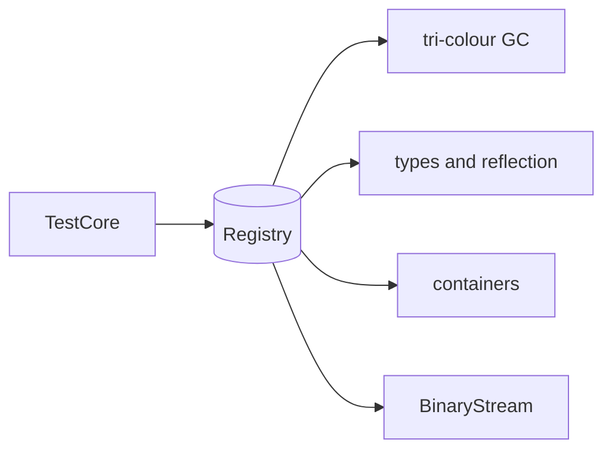

# Core Tests

Sources for `TestCore`, the tests of the core object system. `Main.cpp` here is also the gtest entry point shared by the language test executables.

| Area | Files |
|------|-------|
| Registry and objects | `CoreRegistryTests.cpp`, `CoreObjectTests.cpp`, `TestRegistryOperations.cpp`, `TestClassScripting.cpp` |
| Types and reflection | `CoreTypeTests.cpp`, `TestReflection.cpp`, `TestMethodSignature.cpp`, `TestFunction.cpp` |
| Pointers and memory | `CorePointerTests.cpp`, `TestBasePointer.cpp`, `TestSmartPointers.cpp`, `TestMemoryManagement.cpp` |
| Garbage collection | `TestGarbageCollection.cpp` |
| Containers | `CoreContainerTests.cpp`, `TestArray.cpp`, `TestMap.cpp`, `TestString.cpp`, `TestContainer/` |
| Serialisation | `TestBinaryStream.cpp`, `TestSerialization.cpp` |
| Other | `TestPathname.cpp`, `TestEvents.cpp`, `TestDotGraph.cpp` |
| LLM utilities | `TestModelCache.cpp`, `TestLLMSession.cpp`, `TestRepoIndexer.cpp`, `TestRhoDataset.cpp`, `TestLlm*.cpp` |

See [Common](Common/README.md) for the shared fixtures.
