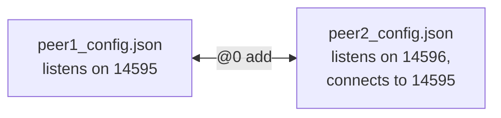

# Network Configuration Files

JSON peer configurations from KAI's earlier standalone networking apps.

**Status: stale.** The apps that read these files (`NetworkPeer`, `ConfigurableServer`, `ConfigurableClient`) no longer exist, and the scripts that use them (`Scripts/network/run_peers.sh`, `automated_demo.sh`, `Scripts/p2p_test*.sh`, `Scripts/calc_test.sh`) will not build. Peer-to-peer use is now through the Console's `/network`, `/connect` and `/@n` commands; see [Console Networking](../Doc/CONSOLE_NETWORKING.md). The format is kept here for reference.



## Overview

The configurations specify:
- Network ports and listening behavior
- Connections to other peers
- Pre-defined commands for remote execution
- Interactive mode settings

Using these configuration files, you can quickly set up peers in different configurations for testing and development.

## Available Configuration Files

- **peer1_config.json**: Server-like peer that listens for connections and provides commands
- **peer2_config.json**: Client-like peer that connects to peer1 and can execute commands remotely
- **minimal_config.json**: Minimalist configuration for basic testing
- **server_config.json**, **client_config.json**, **server_test_config.json**, **client_test_config.json**: server/client pairs (the test pair is regenerated by `Scripts/calc_test.sh`)

## Configuration Format Reference

```json
{
    "listenPort": 14595,       // Port to listen on (integer)
    "autoListen": true,        // Whether to automatically start listening (boolean)
    "interactive": true,       // Whether to accept commands from stdin (boolean)
    "peers": [                 // Array of peers to connect to
        {
            "host": "127.0.0.1",  // Hostname or IP address (string)
            "port": 14595          // Port number (integer)
        }
    ],
    "commands": {              // Dictionary of commands available for remote execution
        "add": "calc 1+2",     // Command name: command to execute
        "hello": "echo Hello World",
        "list_files": "ls -la"
    }
}
```

### Configuration Options

| Option | Type | Description |
|--------|------|-------------|
| `listenPort` | Integer | The port number to listen on for incoming connections |
| `autoListen` | Boolean | If true, automatically starts listening on startup |
| `interactive` | Boolean | If true, accepts commands from standard input |
| `peers` | Array | List of peers to connect to on startup |
| `peers[].host` | String | Hostname or IP address of a peer |
| `peers[].port` | Integer | Port number of a peer |
| `commands` | Object | Dictionary mapping command names to their implementations |

## Usage Guide

### Basic Usage

To use these configuration files, run the NetworkPeer executable:

```bash
./Bin/NetworkPeer /path/to/config.json
```

For example:
```bash
cd $KAI_ROOT/build && ./Bin/NetworkPeer ../config/peer1_config.json
```

### Interactive Commands

When running in interactive mode, the NetworkPeer application supports these commands:

- `help`: Display available commands
- `peers`: List connected peers
- `exit`: Exit the application
- `@<peer_index> <command>`: Execute a command on a remote peer

### Remote Command Execution

To execute a command on a remote peer, use the syntax:

```
@peer_index command_name
```

For example, to execute the "add" command on peer 0:
```
@0 add
```

This will execute the "calc 1+2" command on the remote peer and return the result.

## Testing and Examples

For working network demos, use `Scripts/network/run_continuation_migration_demo.sh` and the Console's `/network` commands; see [Scripts/network](../Scripts/network/README.md).

## Advanced Configuration

### Custom Command Examples

```json
{
    "commands": {
        "system_info": "uname -a",
        "memory_usage": "free -h",
        "calculate": "calc",
        "update_time": "date > /tmp/last_update.txt && echo 'Time updated'"
    }
}
```

### Multiple Peer Connections

```json
{
    "peers": [
        {"host": "192.168.1.10", "port": 14595},
        {"host": "192.168.1.11", "port": 14595},
        {"host": "10.0.0.5", "port": 14600}
    ]
}
```

## Troubleshooting

- If connections fail, ensure the specified ports are open and not blocked by firewalls
- For connection issues on localhost, try using "127.0.0.1" explicitly rather than "localhost"
- If commands fail to execute remotely, check that they are properly defined in the server peer's config