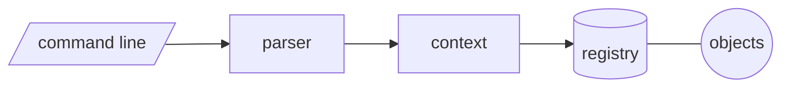

# ksh (KAI Object Shell)

A next-generation shell built on C++23 and KAI, targeting Clang. It is a general-purpose shell in its own right, not only a front end to KAI.



| Path | Contents |
|------|----------|
| `src/main.cpp` | The `ksh` executable |
| `src/parser.cpp`, `context.cpp`, `object.cpp`, `registry.cpp` | `ksh_core` library |
| `include/ksh/` | Headers |
| `tests/test_ksh.cpp` | `ksh_tests` |

## Building

It is built as part of CppKAI, or standalone:

```bash
cmake -S . -B build -G Ninja -DCMAKE_C_COMPILER=clang -DCMAKE_CXX_COMPILER=clang++
cmake --build build
ctest --test-dir build --output-on-failure
./build/ksh
```
