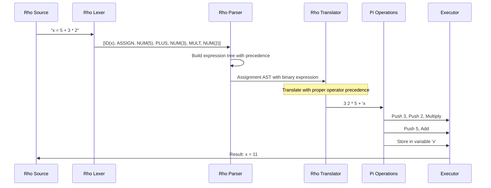
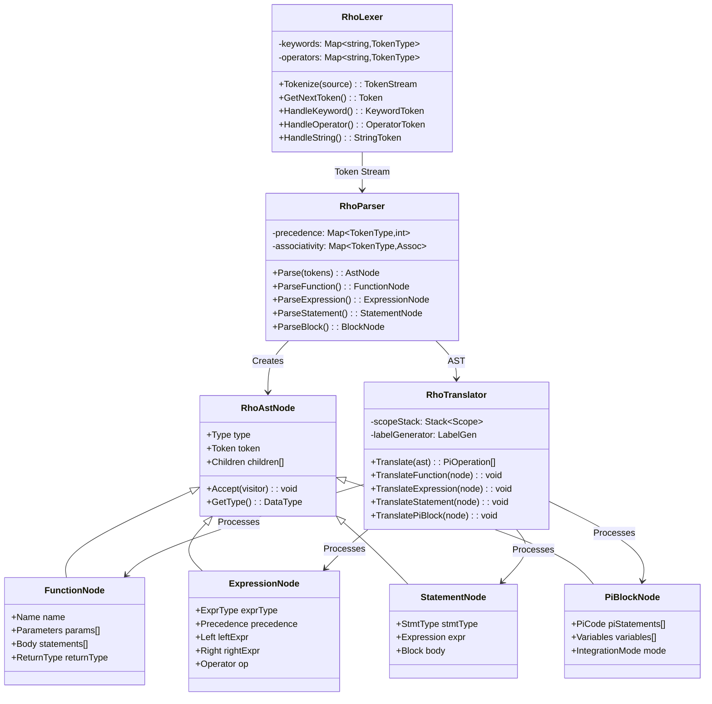
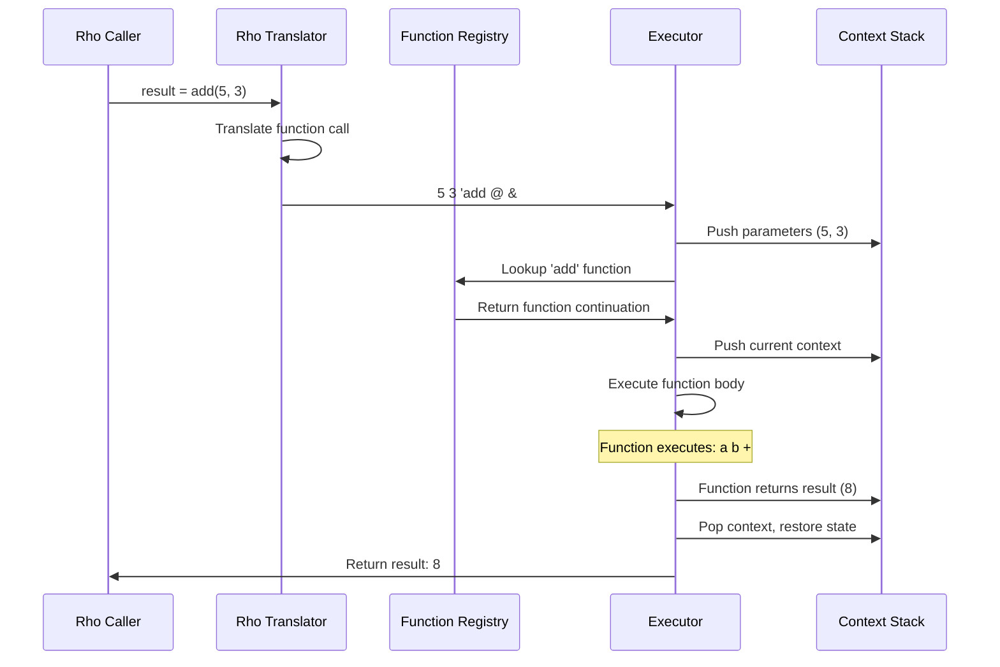
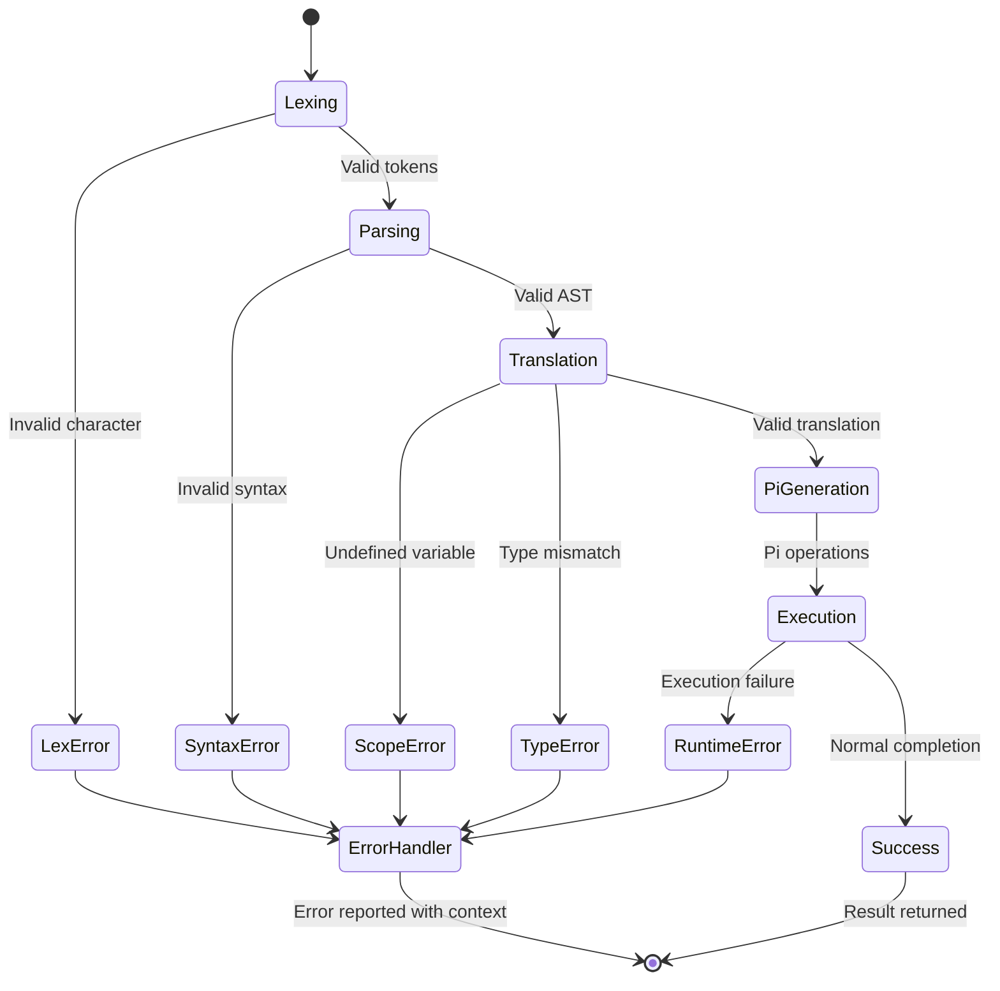
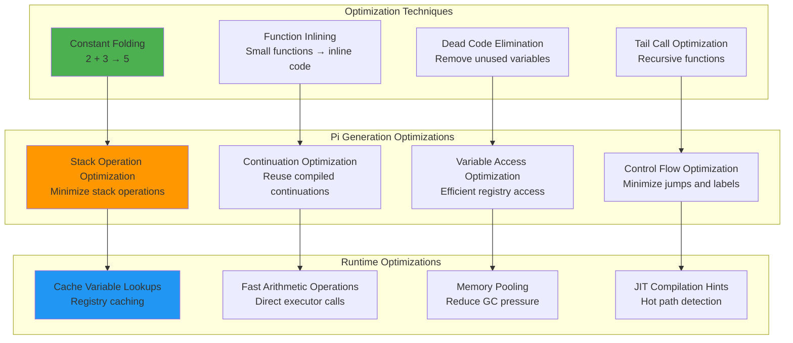
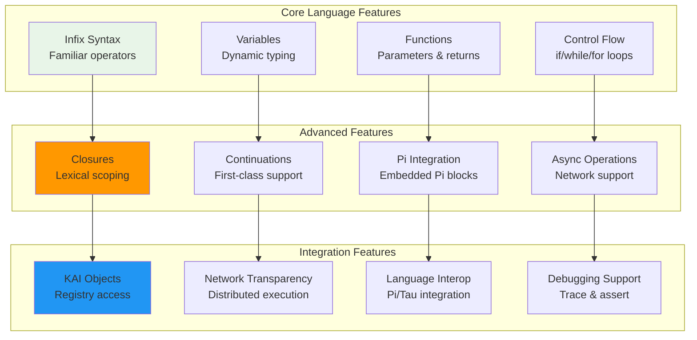

# Rho Language Architecture

## Rho Infix Language Translation Pipeline

```mermaid
graph TB
    subgraph "Rho Source Code"
        SRC[Rho Source<br/>fun add(a, b) {<br/>  return a + b<br/>}<br/>result = add(5, 3)]
    end
    
    subgraph "Lexical Analysis"
        LEX[Rho Lexer<br/>Tokenization]
        TOKENS[Token Stream<br/>FUN, IDENTIFIER, LPAREN<br/>IDENTIFIER, COMMA, etc.]
    end
    
    subgraph "Syntax Analysis"  
        PAR[Rho Parser<br/>AST Construction]
        AST[Rho AST Nodes<br/>Function nodes<br/>Expression nodes<br/>Statement nodes]
    end
    
    subgraph "Translation to Pi"
        TRANS[Rho Translator<br/>AST → Pi Operations]
        PI_OPS[Pi Operation Stream<br/>Stack-based operations]
    end
    
    subgraph "Execution Environment"
        EXE[Executor<br/>Stack-based VM]
        DS[Data Stack<br/>Values & Objects]
        CS[Context Stack<br/>Functions & Scope]
        REG[Registry<br/>Variables & Functions]
    end
    
    SRC --> LEX
    LEX --> TOKENS
    TOKENS --> PAR
    PAR --> AST
    AST --> TRANS
    TRANS --> PI_OPS
    PI_OPS --> EXE
    EXE <--> DS
    EXE <--> CS
    EXE <--> REG
    
    style SRC fill:#e8f5e8
    style TRANS fill:#ff9800
    style PI_OPS fill:#9c27b0
    style EXE fill:#4caf50
```

## Rho Expression Translation Model



## Rho Component Architecture



## Rho Control Flow Translation

```mermaid
graph TB
    subgraph "Rho Control Structures"
        IF_RHO[if (condition) {<br/>  statements<br/>} else {<br/>  statements<br/>}]
        WHILE_RHO[while (condition) {<br/>  statements<br/>}]
        FOR_RHO[for (init; cond; inc) {<br/>  statements<br/>}]
        FUNC_RHO[fun name(params) {<br/>  statements<br/>  return expr<br/>}]
    end
    
    subgraph "Pi Translation"
        IF_PI[condition<br/>{ then-branch }<br/>{ else-branch }<br/>ife]
        WHILE_PI['loop_start label<br/>condition<br/>{ statements<br/>  'loop_start goto }<br/>{ } ife]
        FOR_PI[init<br/>'loop_start label<br/>condition<br/>{ statements inc<br/>  'loop_start goto }<br/>{ drop } ife]
        FUNC_PI[{ parameters<br/>  statements<br/>  return-value }<br/>'function_name #]
    end
    
    IF_RHO --> IF_PI
    WHILE_RHO --> WHILE_PI
    FOR_RHO --> FOR_PI
    FUNC_RHO --> FUNC_PI
    
    style IF_RHO fill:#e8f5e8
    style WHILE_RHO fill:#e8f5e8
    style FOR_RHO fill:#e8f5e8
    style FUNC_RHO fill:#e8f5e8
    style IF_PI fill:#9c27b0
    style WHILE_PI fill:#9c27b0
    style FOR_PI fill:#9c27b0
    style FUNC_PI fill:#9c27b0
```

## Rho Scoping and Variable Management

```mermaid
graph LR
    subgraph "Rho Source with Scoping"
        GLOBAL[Global Scope<br/>x = 10]
        FUNC_SCOPE[Function Scope<br/>fun test(y) {<br/>  local = x + y<br/>  return local<br/>}]
        BLOCK_SCOPE[Block Scope<br/>if (condition) {<br/>  temp = 5<br/>}]
    end
    
    subgraph "Scope Translation"
        SCOPE_STACK[Scope Stack<br/>Global → Function → Block]
        VAR_RESOLUTION[Variable Resolution<br/>Search scope chain]
        PI_VARS[Pi Variable Storage<br/>'var_name # / @]
    end
    
    subgraph "Registry Integration"
        REG_GLOBAL[Registry Global<br/>System-wide variables]
        REG_LOCAL[Registry Context<br/>Function-local storage]
        REG_TEMP[Registry Temporary<br/>Block-local storage]
    end
    
    GLOBAL --> SCOPE_STACK
    FUNC_SCOPE --> SCOPE_STACK
    BLOCK_SCOPE --> SCOPE_STACK
    
    SCOPE_STACK --> VAR_RESOLUTION --> PI_VARS
    
    PI_VARS --> REG_GLOBAL
    PI_VARS --> REG_LOCAL
    PI_VARS --> REG_TEMP
    
    style SCOPE_STACK fill:#4caf50
    style VAR_RESOLUTION fill:#ff9800
    style PI_VARS fill:#9c27b0
```

## Rho-Pi Integration Model

```mermaid
graph TB
    subgraph "Rho Code with Pi Blocks"
        RHO_CODE[Rho Code<br/>result = 5 + pi{ 2 3 + }]
        PI_INLINE[Inline Pi: pi{ 2 3 + }]
        PI_BLOCK[Pi Block:<br/>pi{<br/>  stack operations<br/>  'var #<br/>}]
    end
    
    subgraph "Translation Process"
        RHO_PARSE[Parse Rho Expression]
        PI_PARSE[Parse Embedded Pi]
        COMBINE[Combine Operations]
    end
    
    subgraph "Execution"
        RHO_EXEC[Execute: 5 push]
        PI_EXEC[Execute: 2 3 +]
        FINAL_EXEC[Execute: +]
        RESULT[Result: 10]
    end
    
    subgraph "Variable Sharing"
        RHO_VAR[Rho Variables<br/>Accessible via @]
        PI_VAR[Pi Variables<br/>Stored with #]
        SHARED_REG[Shared Registry<br/>Cross-language access]
    end
    
    RHO_CODE --> RHO_PARSE
    PI_INLINE --> PI_PARSE
    PI_BLOCK --> PI_PARSE
    
    RHO_PARSE --> COMBINE
    PI_PARSE --> COMBINE
    COMBINE --> RHO_EXEC
    RHO_EXEC --> PI_EXEC
    PI_EXEC --> FINAL_EXEC
    FINAL_EXEC --> RESULT
    
    RHO_VAR <--> SHARED_REG <--> PI_VAR
    
    style PI_INLINE fill:#9c27b0
    style PI_BLOCK fill:#9c27b0
    style SHARED_REG fill:#ff9800
```

## Rho Function Call Mechanism



## Rho Error Handling and Debugging



## Rho Performance Optimization



## Rho Language Feature Matrix

